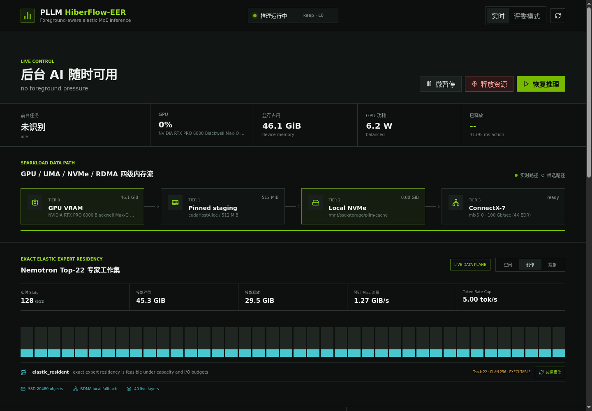

# PLLM HiberFlow

PLLM HiberFlow 是面向 DGX Spark 与 NVIDIA Linux 桌面工作站的前台感知推理运行时。它让常驻的 vLLM 服务在 Blender、游戏、视频编解码或系统内存压力出现时主动让出资源，并在压力消退后恢复服务，从而减少“手动停模型—启动前台应用—重新加载模型”的操作成本。

第一版只管理明确接入的 vLLM 实例，不暂停训练任务、未知 CUDA 进程或未开放 Sleep API 的外部服务。默认模型为 NVIDIA Nemotron 3 Super 120B A12B NVFP4，也可通过环境变量替换为兼容模型。



## 项目价值

- **前台体验优先**：融合 GNOME 前台窗口、NVML 进程与显存指标、NVENC/NVDEC、功耗、Linux PSI、可用内存和供电状态，每 250 ms 更新一次资源判断。
- **分级让渡资源**：在完整驻留、弹性专家驻留、Level 0 微暂停和 Level 1/2 深度休眠之间切换，而不是只有“常驻”与“杀进程”两个选择。
- **模型连续服务**：通过 OpenAI 兼容代理统一接入请求；暂停期间记录可重放请求，恢复后继续由同一控制面处理。
- **MoE 感知优化**：prefill 保持完整专家集合，decode 才允许基于历史路由窗口规划驻留集合；预测失误时仍加载真实 Top-k 专家，不改变模型路由结果。
- **多级数据路径**：HiberCache 保存活跃 KV block，权重可从本地 NVMe 重新加载，专家缓存可选择本地或 RDMA 远端存储。
- **可解释与可演示**：Vue 控制中心、PySide6 悬浮窗和 REST/SSE API 同时展示传感器、状态机、策略原因、能力探测和恢复事件。

PLLM 针对 DGX Spark 的统一内存架构做了显式能力分支：不会把 GB10 上的 host-staged RDMA 描述为 GPUDirect RDMA，也不会把 host backup 当成额外的独立显存层。平台不支持的路径会由能力探测降级或关闭。

## 系统架构

```text
GNOME 前台窗口 ─┐
NVML / Codec ───┤
PSI / 内存 / 电源 ─┼─> Foreground-QoS Agent ─> Policy + Cost Model
vLLM 运行状态 ──┘                              │
                                                ├─> Level 0/1/2 pause & wake
OpenAI 客户端 ─> :17860 代理 ─> vLLM :8000      ├─> Elastic Expert Residency
                         │                      └─> SSD / RDMA 数据路径
                         ├─> Vue Web 控制中心
                         └─> PySide6 桌面悬浮窗
```

控制状态机为：

```text
ACTIVE <-> ELASTIC_RESIDENT -> YIELDING -> QUIESCING
                                      -> HIBERNATED -> RESTORING -> ACTIVE
```

- `ACTIVE`：模型完整驻留并正常接收请求。
- `ELASTIC_RESIDENT`：decode 阶段按资源包络维护部分物理专家槽位。
- `YIELDING`：调用 vLLM Level 0，在 token 边界暂停调度，GPU cache 保持驻留。
- `QUIESCING`：冻结新工作并等待连接器状态进入可提交边界。
- `HIBERNATED`：Level 1 将可恢复权重保留在 host，Level 2 释放权重并从模型目录恢复。
- `RESTORING`：恢复权重、KV 状态和调度器，然后重新开放代理。

HiberCache 已接入 vLLM `OffloadingConnector + TieringOffloadingSpec`。对于尚未提供独立序列化器的混合状态，系统采用缺失 block 的 token 重算回退；事务式 live-state carrier 已实现，但不等同于已经完成所有 NemotronH Mamba/KV/RNG 状态的精确恢复。

## 仓库结构

```text
pllm/                 核心控制器、监控、策略、代理与数据面
frontend/             无需 Node.js 构建的 Vue 3 控制中心
desktop/              PySide6 桌面端与 GNOME Shell 扩展
agents/               Reviewer / Author 双智能体角色约束
scripts/              安装、启动、运维与可选基准工具
rdma_bridge/          C++ RDMA store 与预注册内存池
systemd/              用户级服务模板
tests/                单元测试与 mock 集成配置
docs/                 部署、演示、调研和赛事开发记录
results/              本地生成物目录，仅保留占位文件
vllm_patch/            vLLM 运行时接入补丁
```

## 环境要求

- Linux；完整桌面感知推荐 GNOME Shell 42 或兼容版本。
- Python 3.12。
- NVIDIA 驱动；真实模型路径需要可读。
- 推荐使用 `uv` 创建虚拟环境；也支持 conda。
- 推理环境固定使用 vLLM 0.25.1 和 fastsafetensors 0.3.3，以匹配当前补丁守卫。
- RDMA 为可选能力，需要 CMake、C++ 编译器、libibverbs 开发包和可用的 RDMA 设备。

## 快速开始：无 GPU 演示

这条路径使用 mock vLLM，适合先确认控制面、前端、策略动作和桌面悬浮窗，不会加载真实模型。

```bash
git clone <repository-url> PLLM
cd PLLM
bash scripts/setup_venv.sh
source .venv/bin/activate
```

分别打开两个终端：

```bash
# 终端 1：模拟 vLLM，监听 18000
source .venv/bin/activate
python scripts/mock_vllm.py --port 18000
```

```bash
# 终端 2：使用 mock 集成配置启动 PLLM，监听 17861
source .venv/bin/activate
PLLM_CONFIG="$PWD/tests/fixtures/integration-config.toml" python -m pllm.daemon
```

打开 <http://127.0.0.1:17861>。如需桌面悬浮窗：

```bash
python -m pllm.desktop --api-base http://127.0.0.1:17861
```

控制中心中的回放数据会明确标记为历史回放，不会伪装成当前硬件数据。

## 真实模型部署

### 1. 安装环境

推荐方式：

```bash
cd /path/to/PLLM
bash scripts/setup_venv.sh
source .venv/bin/activate
```

脚本会安装项目、`inference`/`test` 依赖并检查 HiberCache 补丁。若使用 conda：

```bash
bash scripts/setup_conda.sh
conda activate pllm
```

### 2. 准备只读模型和缓存目录

默认模型路径为：

```text
/mnt/ssd-storage/shared_models/NVIDIA-Nemotron-3-Super-120B-A12B-NVFP4
```

模型目录只读复用，不由 PLLM 下载或复制。准备本地状态与专家缓存：

```bash
sudo install -d -m 0750 -o "$USER" -g "$(id -gn)" /mnt/ssd-storage/pllm-cache
install -d -m 0750 /mnt/ssd-storage/$USER/pllm-experts
```

如果模型或缓存位置不同，在启动时设置 `MODEL_PATH`、`HIBERCACHE_DIR` 和 `PLLM_EER_CACHE_DIR`。

### 3. 启动服务

分别启动 vLLM、控制器和桌面端：

```bash
# 终端 1
MODEL_PATH=/path/to/model bash scripts/run_vllm.sh
```

```bash
# 终端 2
bash scripts/run_daemon.sh
```

```bash
# 终端 3，可选
bash scripts/run_desktop.sh
```

默认访问地址：

- Web 控制中心与 REST API：<http://127.0.0.1:17860>
- 健康检查：<http://127.0.0.1:17860/healthz>
- OpenAI 兼容 base URL：`http://127.0.0.1:17860/v1`
- 后端 vLLM：`http://127.0.0.1:8000`

客户端应连接 PLLM 代理，而不是直接连接 vLLM：

```bash
curl http://127.0.0.1:17860/v1/chat/completions \
  -H 'Content-Type: application/json' \
  -d '{
    "model": "nvidia/nemotron-3-super",
    "messages": [{"role": "user", "content": "Hello"}],
    "stream": false
  }'
```

所有默认服务只绑定 `127.0.0.1`。如需跨主机访问，请在可信网络中配置认证反向代理，不要直接暴露控制端点。

## 配置

默认配置位于 `~/.config/pllm/config.toml`；首次启动会自动生成。也可通过 `PLLM_CONFIG=/path/to/config.toml` 指定独立配置。

最小示例：

```toml
[pllm]
api_host = "127.0.0.1"
api_port = 17860
default_vllm_urls = ["http://127.0.0.1:8000"]
model_path = "/path/to/model"
mode = "auto"
poll_interval_seconds = 0.25
min_free_vram_gb = 8.0
min_available_memory_gb = 20.0
hibercache_enabled = true
hibercache_dir = "/mnt/ssd-storage/pllm-cache"
expert_residency_enabled = true
expert_data_plane_enabled = true
expert_auto_resize_enabled = false
dry_run = false
```

策略模式：

- `auto`：按传感器与成本模型自动决策。
- `ai_priority`：优先保持推理服务。
- `foreground_priority`：优先满足前台应用资源需求。
- `keep_sleeping`：保持休眠，直到显式唤醒或修改策略。

常用 vLLM 环境变量：

| 变量 | 默认值 | 用途 |
| --- | --- | --- |
| `MODEL_PATH` | Nemotron 默认目录 | 模型目录 |
| `VLLM_PORT` | `8000` | vLLM 监听端口 |
| `HIBERCACHE_DIR` | `/mnt/ssd-storage/pllm-cache` | KV 二级缓存目录 |
| `PLLM_HIBERCACHE_STAGING_MB` | `512` | host staging 大小 |
| `PLLM_VLLM_GPU_MEMORY_UTILIZATION` | `0.85` | vLLM 显存预算比例 |
| `PLLM_VLLM_MAX_MODEL_LEN` | `32768` | 最大上下文长度 |
| `PLLM_VLLM_MAX_NUM_SEQS` | `2` | 原生模式最大并发序列 |
| `PLLM_VLLM_ENABLE_SLEEP_MODE` | `1` | 启用 vLLM Sleep API |
| `PLLM_VLLM_ENABLE_HIBERCACHE` | `1` | 启用 HiberCache |

启动脚本会依次查找仓库 `.venv`、当前 venv/conda、`PATH` 和兼容的历史 conda 环境；可用 `PLLM_PYTHON`、`VLLM_BIN` 显式覆盖。

## Elastic Expert Residency

首次启用 EER 前，需在 GPU 空闲时导出模型转换后的 Marlin runtime experts：

```bash
MODEL_PATH=/path/to/model bash scripts/run_vllm_export_experts.sh
python scripts/eer_runtime_ctl.py status
```

导出完成后启动弹性数据面：

```bash
PLLM_EER_SLOTS_PER_LAYER=512 bash scripts/run_vllm_eer.sh
```

EER 模式默认 `max-num-seqs=1`，保证 request-local 路由代次不被并发污染。prefill 阶段保持完整驻留；decode 只有在观察窗口、容量、预测 miss 和 TPOT 约束同时满足时才收缩，否则维持完整驻留或进入让渡/休眠。`expert_auto_resize_enabled` 默认关闭，需在目标硬件完成模型级验收后再启用自动物理重建。

主要变量：

| 变量 | 用途 |
| --- | --- |
| `PLLM_EER_CACHE_DIR` | runtime expert 缓存目录 |
| `PLLM_EER_SLOTS_PER_LAYER` | 每层物理专家槽位数 |
| `PLLM_EER_CACHE_QUOTA_GIB` | 本地专家缓存配额 |
| `PLLM_EER_RDMA_PEER` | 可选远端 warm source |
| `PLLM_EER_RDMA_TOKEN_FILE` | RDMA 认证 token 文件 |

## RDMA 扩展

构建 C++ 数据面：

```bash
cmake -S rdma_bridge -B rdma_bridge/build -DCMAKE_BUILD_TYPE=Release
cmake --build rdma_bridge/build -j
```

RDMA store、预注册共享 host memory pool、双机启动顺序和认证参数见 [`rdma_bridge/README.md`](rdma_bridge/README.md)。在 DGX Spark/GB10 上该路径使用注册的 host buffer，数据终点仍是 host memory；后续进入 GPU/UMA 可见区域需要额外 copy，不能宣称为 GPUDirect RDMA。

认证 token 应放在 `~/.config/pllm/rdma-token` 并限制权限：

```bash
install -d -m 0700 ~/.config/pllm
install -m 0600 /path/to/token ~/.config/pllm/rdma-token
```

## 桌面与常驻服务

安装 GNOME Shell 前台感知扩展：

```bash
bash scripts/install_gnome_extension.sh
```

若扩展未立即加载，请注销后重新登录。安装用户级 systemd 服务：

```bash
bash scripts/install_user_services.sh
systemctl --user enable --now pllm-daemon pllm-desktop
```

查看状态和日志：

```bash
systemctl --user status pllm-daemon pllm-desktop
journalctl --user -u pllm-daemon -f
```

RDMA 服务保持 opt-in，不会由安装脚本自动启动。

## API

| 方法 | 路径 | 用途 |
| --- | --- | --- |
| `GET` | `/healthz` | 控制器健康状态 |
| `GET` | `/api/v1/status` | 状态机、传感器和成本决策 |
| `GET` | `/api/v1/capabilities` | UMA、loader、HiberCache 与 RDMA 能力 |
| `GET` | `/api/v1/telemetry/stream` | SSE 实时遥测 |
| `GET` | `/api/v1/vllm` | vLLM 服务发现与可控性 |
| `GET` | `/api/v1/events` | 策略、暂停与恢复事件 |
| `GET` | `/api/v1/replays` | 暂停期间排队的请求 |
| `GET` | `/api/v1/expert-residency` | Expert catalog 与当前驻留计划 |
| `GET` | `/api/v1/expert-dataplane` | 进程内 slot、SSD、RDMA 状态 |
| `PUT` | `/api/v1/policy` | 更新策略模式和阈值 |
| `POST` | `/api/v1/policy/compile` | 将自然语言偏好编译为受限本地规则 |
| `POST` | `/api/v1/actions` | `yield`、`hibernate`、`wake`、`auto`、`snooze` |
| `POST` | `/api/v1/expert-residency/plan` | 计算资源包络建议 |
| `POST` | `/api/v1/expert-dataplane/actions` | `resize`、`prefetch`、`evict`、`evict_all` |
| `POST` | `/v1/chat/completions` | OpenAI 兼容推理代理 |

手动释放与恢复资源：

```bash
curl -X POST http://127.0.0.1:17860/api/v1/actions \
  -H 'Content-Type: application/json' \
  -d '{"action":"hibernate","level":2}'

curl -X POST http://127.0.0.1:17860/api/v1/actions \
  -H 'Content-Type: application/json' \
  -d '{"action":"wake"}'
```

## 双智能体文档审阅

`ReviewerAgent` 与 `AuthorAgent` 使用相互隔离的 system prompt：前者检查新颖性、正确性、证据和 DGX Spark 适配性，后者逐条答辩并生成修订稿。编排器兼容本地 NVIDIA Nemotron/vLLM，也兼容阶跃星辰等提供 OpenAI 兼容 Chat Completions 接口的模型服务。

```bash
# base URL 填写 /v1 之前的部分；不要把真实密钥写入仓库
export PLLM_REVIEW_BASE_URL='<openai-compatible-base-url>'
export PLLM_REVIEW_MODEL='<model-id>'
export PLLM_REVIEW_API_KEY='<api-key>'

python scripts/run_peer_review.py --rounds 4
```

默认审阅 `docs/PLLM项目报告.md`，以暂停恢复调研作为上下文，输出到已忽略的 `results/peer-review/`。可用 `--manuscript`、重复的 `--context` 和 `--output-dir` 替换输入输出；只有显式传入 `--apply-final` 才会覆盖原文。更多说明见 [`agents/README.md`](agents/README.md)。

## 运维与故障排查

- **提示找不到 vLLM**：激活 `.venv`/conda，或设置 `VLLM_BIN` 与 `PLLM_PYTHON`。
- **提示模型不可读**：确认 `MODEL_PATH/config.json` 存在且当前用户可读。
- **控制中心找不到后端**：检查 `default_vllm_urls`、vLLM 端口以及 `/v1/models` 是否可访问。
- **HiberCache 补丁警告**：重新运行 `python scripts/apply_vllm_hibercache_patch.py`；升级 vLLM 后必须重新检查版本守卫。
- **GNOME 前台应用为空**：确认扩展已启用，并在安装后重新登录桌面会话。
- **EER 拒绝启动**：先确认 `runtime-manifest.json` 完整，或正确配置 RDMA warm source。
- **只观察、不执行策略**：使用 `python -m pllm.daemon --dry-run` 或配置 `dry_run = true`。

运行生成的 JSON、CSV、图表、日志、审稿输出和临时数据统一写入 `results/`、`exp/` 或自定义目录；这些目录不会进入版本控制。模型、缓存、API 密钥和 RDMA token 也不得提交。

## 文档

- [部署说明](docs/部署说明.md)
- [Blender 手动演示操作指南](docs/Blender手动演示操作指南.md)
- [项目报告](docs/PLLM项目报告.md)
- [暂停恢复技术调研](docs/主流推理框架暂停恢复调研.md)
- [演示视频脚本](docs/演示视频脚本.md)
- [DGX Spark 黑客松十日谈](https://alumnisjtuedu-my.sharepoint.com/:w:/g/personal/cong258258_alumni_sjtu_edu_cn/IQAKso6t_M5MRIciYNYE9xo8ATOk_BnoRPakXdcfrgs4Vi4?e=shrDkp)

## AI 协助声明

本项目在文档整理、代码审阅与部分实现过程中使用了 AI 辅助；项目设计、工程取舍、集成、运行与结果核验由参赛团队负责。涉及 AI 生成或辅助的公开内容将遵循发布平台的标注规范。
