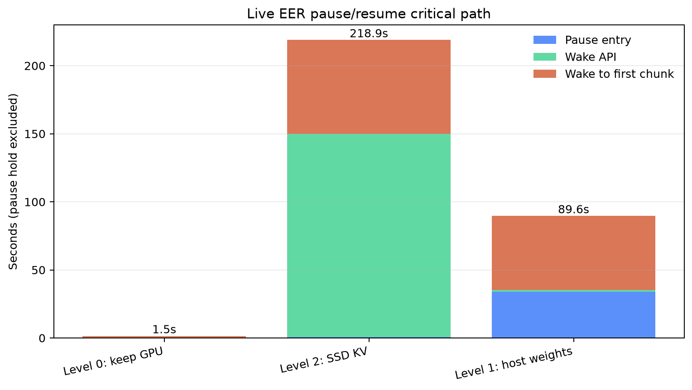
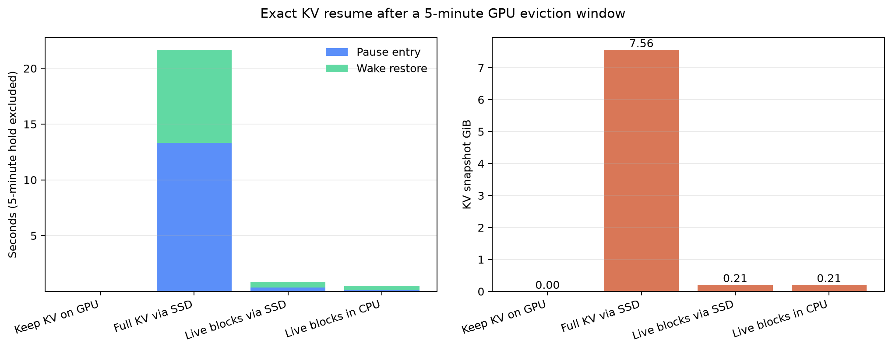

# 5 分钟暂停后的 KV / MoE 恢复优化

日期：2026-07-19

## 结论

当前正确且效果最好的组合是：

1. 用 vLLM HiberCache 只保存活跃请求拥有的完整 KV/Mamba block，不搬整个预分配 cache pool。
2. 独显且主存宽裕时选择 Level 1：权重备份到 host，KV 驱逐到本机持久层；5 分钟后不再扫描完整 checkpoint。
3. 主存也要让给其他工作、DGX Spark UMA 或内存压力高时选择 Level 2：仍使用活跃 block SSD，但接受权重冷加载成本。
4. MoE 保持精确 sigmoid+bias Top-22 路由；Recent-32 只决定预取/驱逐顺序，route miss 必须在执行前加载正确 expert。

本机真实 EER 380-slot 结果中，Level 1 把固定 5 分钟之外的暂停入口到首个续传 chunk 从 Level 2 的 218.87 秒降到 89.62 秒，缩短 59.05%（2.44x）；从 wake 开始计算则从 218.29 秒降到 55.56 秒，缩短 74.55%（3.93x）。代价是 54.84 GiB host 权重备份。

## 设计边界

Nemotron-3-Super-120B-A12B-NVFP4 使用 512 个 LatentMoE FFN experts，每 token 由 1024 维 latent space 上的 sigmoid router 加 expert bias 选出 Top-22。Mamba-2 状态使路由强依赖完整上下文。因此：

- 不能用纯 token 语义预测替代真实路由。
- 不能为了命中率裁掉真实 Top-22 中的任何 expert。
- 可以保存近期真实 route history，把高概率 expert 提前搬入；预测失败时仍同步补齐精确 Top-22。
- router、latent down/up projection、shared expert 和 token ledger 是恢复核心，不参与有损驱逐。
- 注意力下一 token 需要该请求的全部历史 KV；安全的“稀疏”是排除未占用 block 和其他请求的无关 prefix block，不是裁掉活跃请求内部的有效 KV。

## KV 方案对比

CUDA microbenchmark 使用本机日志中的 7.56 GiB KV allocation、1,182,168-token capacity、32,768 live tokens、16-token logical block。每组暂停 300 秒；可驱逐方案在暂停期间实际触碰 90 GiB 竞争 allocation，并在恢复前释放。活跃字节恢复后逐块完全相等。

| 方案 | 快照 | 暂停入口 | 恢复 | 固定等待外中断 | 释放 KV GPU 空间 | 90 GiB admission |
| --- | ---: | ---: | ---: | ---: | ---: | --- |
| KV 留在 GPU | 0 | 0.00008s | 0.00004s | 0.00012s | 0 | 失败 |
| 全量 KV 经 SSD | 7.56 GiB | 13.300s | 8.366s | 21.666s | 7.56 GiB | 成功 |
| 活跃 block 经 SSD | 214.58 MiB | 0.340s | 0.538s | 0.878s | 7.56 GiB | 成功 |
| 活跃 block 留 CPU | 214.58 MiB | 0.129s | 0.395s | 0.524s | 7.56 GiB | 成功 |

活跃 block SSD 相比全量 SSD 缩短 95.95%（24.67x），只保存 2.77% 的 allocation，同时释放相同 GPU 空间。CPU 热层的 microbenchmark 更快，但当前 vLLM connector 不能只保留 primary data 而跳过 job bookkeeping quiesce；真实 5 分钟实验在 wake 后触发 `_jobs` invariant，故该路径被否决且未作为默认提交。

## 真实 EER 对比

共同配置：本机 RTX PRO 6000 Blackwell 96GB、EER 380 physical slots/layer、Recent-32、Top-22、`max_num_batched_tokens=17`、7.87 GiB KV pool、512 MiB CPU staging 和 7,103-token prompt。Level 1/2 保持 300 秒；Level 0 same-stream 对照保持 2 秒，另有 300 秒 CUDA keep-GPU 基准证明等待时长不改变其零恢复/零释放性质。HiberCache 实际持久化 6 个 17,301,504-byte hybrid pages，共 99.0 MiB；期间没有重复写出。

| 路径 | 暂停入口 | Wake API | Wake 后首 chunk | 总关键路径 | GPU 释放 | Host 代价 |
| --- | ---: | ---: | ---: | ---: | ---: | ---: |
| Level 0，不搬 | 0.441s | 0.007s | 1.021s | 1.469s | 0 | 0 |
| Level 2，active SSD | 0.581s | 149.302s | 68.987s | 218.870s | 62.72 GiB | 约 0.5 GiB staging |
| Level 1，host weights + active SSD | 34.057s | 1.298s | 54.263s | 89.617s | 62.60 GiB | 54.84 GiB weights + staging |

Level 1 和 Level 2 暂停期间都成功运行并触碰了 60 GiB 本机 CUDA 竞争任务。Level 2 的主要瓶颈不是 KV allocation wake（0.022 秒），而是 `reload_weights` 扫描并处理 74.80 GiB checkpoint（148.80 秒）。Level 1 用 33.69 秒的 pause-entry D2H copy 和 54.84 GiB host memory 换来 1.29 秒权重/KV allocation wake。

## MoE 恢复策略

已有 60 requests / 1,033 decode tokens / 909,040 expert accesses 的 route replay 表明最近路由有局部性，但不足以支持激进裁剪：最近 32 token 覆盖 82.9% expert accesses。最终策略是：

1. 保存每层最近 32 个 token 的真实 Top-22 route IDs。
2. 唤醒时优先恢复这组 expert，再用 window-LFU 填剩余物理槽位。
3. 当前 token 的真实 sigmoid+bias Top-22 永远最高优先；保护集占满时丢弃预测保护，而不是拒绝精确 route。
4. 380-slot 静态物理配置相对 384 slots 释放 320 MiB，TPOT 慢 4.2%；不再默认做 368/352/320 的激进暂停驱逐。

Recent-32 的收益与本页 KV/Level-1 数字正交，没有把两个实验相加或假设 I/O 完全重叠。

## 实现

- `pllm/pause_resume.py`：通用 active-block exact format、恢复成本模型和策略选择；容量与带宽均由调用方传入。
- `scripts/benchmark_kv_pause_strategies.py`：本机 GPU 5 分钟 KV 驱逐、竞争 allocation 和 exact restore 基准。
- `scripts/benchmark_continuity.py`：Level 0/1/2 same-stream 细分计时。
- `scripts/run_vllm_eer.sh`：缩容时按 `floor(slots / top_k)` 自动限制 exact profiling/prefill batch；用户显式配置仍优先。
- `pllm/vllm_eer_runtime.py`：修复 Level-2 layerwise `reload_weights` 不在全局 vLLM config context 时的 EER 重注册错误。
- `scripts/apply_vllm_hibercache_patch.py`：严格校验 vLLM 0.25.1 补丁内容；安全默认会重置 CPU primary/job state，同时保留 FS secondary active blocks。

路径、模型、staging、slot、Top-k、时长和带宽均可由 CLI/环境变量配置，没有账户名或 `/home/<user>` 硬编码。EER cache 默认从当前有效用户派生。

## 正确性边界

- CUDA active-block restore：所有组逐字节完全相等。
- 真实 Level 0/1/2：暂停期间 0 chunk，same-stream 均完成且没有重连。
- 独立 deterministic control 与 resumed stream 的文本 hash 不相等；Level 0 也不相等，因此当前 EER/FP8 路径的跨请求 bit-exact 本身未成立。这里不声明 Level-1/2 bit-exact resume 已证明。
- 跳过 connector quiesce 的 CPU-primary 保留实验导致 EngineCore fatal assertion，已否决并恢复安全补丁。
- 全量 512-expert 原生 sleep 服务在 Marlin 转换峰值需要额外 1.97 GiB、总占用约 93.08 GiB而 OOM；真实端到端数据来自已验证的 EER 380-slot 配置。

## 推荐决策

- 暂停很短或不需要给别的 GPU 工作让空间：Level 0。
- 约 5 分钟、独显、`MemAvailable` 能安全容纳约 55 GiB 权重备份：Level 1 + active-block SSD + Recent-32。这是当前最优正确路径。
- 主存压力高、UMA 或其他工作也需要 host memory：Level 2 + active-block SSD + Recent-32。
- 下一项最高价值优化：增加 EER-aware Level-2 reload，只读取 dense/router/shared core，并从 checksummed expert store 恢复 Recent-32 热 experts；其余 expert 在真实 Top-22 miss 时按需加载。目标是去掉当前 148.8 秒全 checkpoint reload，但在实现并实测前不计入本次提升。

原始 JSON、CSV、日志和 PNG 位于 `exp/kv_pause_20260719/`；Recent-32 的独立报告位于 `exp/moe_decode_locality_20260719/better_strategy/report.md`。
