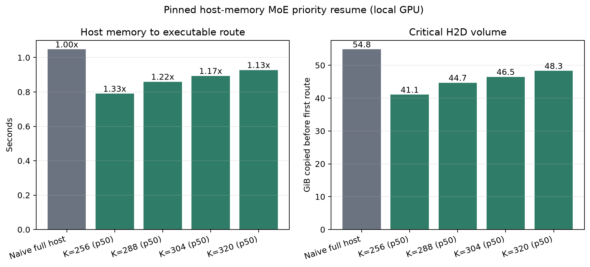
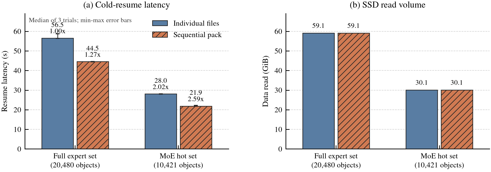

# 5 分钟暂停后的 KV / MoE 恢复优化

日期：2026-07-19

## 结论

当前正确且效果最好的组合是：

1. 用 vLLM HiberCache 只保存活跃请求拥有的完整 KV/Mamba block，不搬整个预分配 cache pool。
2. 独显且主存宽裕时选择 Level 1：权重备份到 host，KV 驱逐到本机持久层；5 分钟后不再扫描完整 checkpoint。
3. 主存也要让给其他工作、DGX Spark UMA 或内存压力高时选择 Level 2：仍使用活跃 block SSD，但接受权重冷加载成本。
4. MoE 保持精确 sigmoid+bias Top-22 路由；Recent-32 只决定预取/驱逐顺序，route miss 必须在执行前加载正确 expert。
5. DGX Spark 统一内存上不使用 host-weight Level 1 作为容量优化；5 分钟窗口内生成 Recent-32 连续 SSD hot-pack，wake 时只恢复热 experts 和精确 route misses。

本机真实 EER 380-slot 结果中，Level 1 把固定 5 分钟之外的暂停入口到首个续传 chunk 从 Level 2 的 218.87 秒降到 89.62 秒，缩短 59.05%（2.44x）；从 wake 开始计算则从 218.29 秒降到 55.56 秒，缩短 74.55%（3.93x）。代价是 54.84 GiB host 权重备份。

## 设计边界

Nemotron-3-Super-120B-A12B-NVFP4 使用 512 个 LatentMoE FFN experts，每 token 由 1024 维 latent space 上的 sigmoid router 加 expert bias 选出 Top-22。Mamba-2 状态使路由强依赖完整上下文。因此：

- 不能用纯 token 语义预测替代真实路由。
- 不能为了命中率裁掉真实 Top-22 中的任何 expert。
- 可以保存近期真实 route history，把高概率 expert 提前搬入；预测失败时仍同步补齐精确 Top-22。
- router、latent down/up projection、shared expert 和 token ledger 是恢复核心，不参与有损驱逐。
- 注意力下一 token 需要该请求的全部历史 KV；安全的“稀疏”是排除未占用 block 和其他请求的无关 prefix block，不是裁掉活跃请求内部的有效 KV。

## KV 方案对比

CUDA microbenchmark 使用本机日志中的 7.56 GiB KV allocation、1,182,168-token capacity、32,768 live tokens、16-token logical block。每组暂停 300 秒；可驱逐方案在暂停期间实际触碰 90 GiB 竞争 allocation，并在恢复前释放。活跃字节恢复后逐块完全相等。

| 方案 | 快照 | 暂停入口 | 恢复 | 固定等待外中断 | 释放 KV GPU 空间 | 90 GiB admission |
| --- | ---: | ---: | ---: | ---: | ---: | --- |
| KV 留在 GPU | 0 | 0.00008s | 0.00004s | 0.00012s | 0 | 失败 |
| 全量 KV 经 SSD | 7.56 GiB | 13.300s | 8.366s | 21.666s | 7.56 GiB | 成功 |
| 活跃 block 经 SSD | 214.58 MiB | 0.340s | 0.538s | 0.878s | 7.56 GiB | 成功 |
| 活跃 block 留 CPU | 214.58 MiB | 0.129s | 0.395s | 0.524s | 7.56 GiB | 成功 |

活跃 block SSD 相比全量 SSD 缩短 95.95%（24.67x），只保存 2.77% 的 allocation，同时释放相同 GPU 空间。CPU 热层的 microbenchmark 更快，但当前 vLLM connector 不能只保留 primary data 而跳过 job bookkeeping quiesce；真实 5 分钟实验在 wake 后触发 `_jobs` invariant，故该路径被否决且未作为默认提交。

## 真实 EER 对比

共同配置：本机 RTX PRO 6000 Blackwell 96GB、EER 380 physical slots/layer、Recent-32、Top-22、`max_num_batched_tokens=17`、7.87 GiB KV pool、512 MiB CPU staging 和 7,103-token prompt。Level 1/2 保持 300 秒；Level 0 same-stream 对照保持 2 秒，另有 300 秒 CUDA keep-GPU 基准证明等待时长不改变其零恢复/零释放性质。HiberCache 实际持久化 6 个 17,301,504-byte hybrid pages，共 99.0 MiB；期间没有重复写出。

| 路径 | 暂停入口 | Wake API | Wake 后首 chunk | 总关键路径 | GPU 释放 | Host 代价 |
| --- | ---: | ---: | ---: | ---: | ---: | ---: |
| Level 0，不搬 | 0.441s | 0.007s | 1.021s | 1.469s | 0 | 0 |
| Level 2，active SSD | 0.581s | 149.302s | 68.987s | 218.870s | 62.72 GiB | 约 0.5 GiB staging |
| Level 1，host weights + active SSD | 34.057s | 1.298s | 54.263s | 89.617s | 62.60 GiB | 54.84 GiB weights + staging |

Level 1 和 Level 2 暂停期间都成功运行并触碰了 60 GiB 本机 CUDA 竞争任务。Level 2 的主要瓶颈不是 KV allocation wake（0.022 秒），而是 `reload_weights` 扫描并处理 74.80 GiB checkpoint（148.80 秒）。Level 1 用 33.69 秒的 pause-entry D2H copy 和 54.84 GiB host memory 换来 1.29 秒权重/KV allocation wake。

## MoE 恢复策略

已有 60 requests / 1,033 decode tokens / 909,040 expert accesses 的 route replay 表明最近路由有局部性，但不足以支持激进裁剪：最近 32 token 覆盖 82.9% expert accesses。最终策略是：

1. 保存每层最近 32 个 token 的真实 Top-22 route IDs。
2. 唤醒时优先恢复这组 expert，再用 window-LFU 填剩余物理槽位。
3. 当前 token 的真实 sigmoid+bias Top-22 永远最高优先；保护集占满时丢弃预测保护，而不是拒绝精确 route。
4. 380-slot 静态物理配置相对 384 slots 释放 320 MiB，TPOT 慢 4.2%；不再默认做 368/352/320 的激进暂停驱逐。

Recent-32 的收益与本页 KV/Level-1 数字正交，没有把两个实验相加或假设 I/O 完全重叠。

## Host memory 中的 MoE 优先恢复

为回答“普通 Level-1 host memory 已经很快，MoE 还能否再快 10%”，新增了同一 size-matched pinned host byte carrier 上的物理 H2D 对比。实验使用实测 54.84 GiB Level-1 host image 大小，其中 40 层 × 380 slots 的 routed experts 按真实 3,097,457-byte runtime object 计为 43.85 GiB，其余 10.99 GiB dense/router/shared 权重始终恢复。carrier 在暂停前完成分配和触页，随后保持 300 秒；期间本机 GPU 上的 60 GiB 竞争 allocation 被循环触碰 1,756,256 次。

朴素基线一次搬回完整 54.84 GiB。优化路径在 5 分钟 CPU 窗口内按 Recent-32 频率和最近位置把热 experts 排到连续前缀；wake 时先搬 dense core 和热前缀，真实下一 token 不在热集的 Top-22 experts 在对应层执行前从同一 host image 同步补齐。973 个真实暂停窗口全部保持精确 route，不用预测结果替换 sigmoid+bias Top-22。

| 热 slots/层 | 首 token exact misses（p50/p95，40 层合计） | H2D p50 | 比朴素快 | H2D p95 | 比朴素快 |
| ---: | ---: | ---: | ---: | ---: | ---: |
| 朴素 380 | 0 | 1.0476s | - | 1.0476s | - |
| 256 | 181 / 327 | 0.7902s | 24.57% | 0.8030s | 23.35% |
| 288 | 158 / 285 | 0.8597s | 17.93% | 0.8718s | 16.78% |
| 304 | 145 / 268 | 0.8935s | 14.71% | 0.9050s | 13.61% |
| 320 | 134 / 249 | 0.9279s | 11.43% | 0.9385s | 10.41% |

K=256 是当前 H2D 首路由最优点，适合“先恢复可执行集，随后后台补到 380”；K=320 是更保守的启动点，在 p95 miss 下仍超过 10%，并减少恢复后的短期冷 miss。该结果已经包含逐 expert H2D 调用开销和每次传输后的非零 marker 校验，但 carrier 只匹配真实 tensor 的字节规模，并未执行模型计算；它仍是 allocator-level 物理恢复基准，不是完整模型 TTFT。vLLM 0.25.1 `CuMemAllocator` 当前按整块 `weights` tag 恢复，生产路径尚未接入 expert-range selective wake，因此不能把 24.57% 直接写成端到端 TTFT 提升。

## 统一内存机器的 SSD MoE 恢复

DGX Spark/GB10 的 CPU 与 GPU 共享同一物理 LPDDR5x 容量。逻辑上仍有 CPU address space，但把 GPU 权重备份到“host memory”不会释放统一内存容量，因此容量抢占应进入 SSD。针对这一点，新增两项可叠加优化：

1. 在 5 分钟暂停窗口内，把待恢复 experts 原子拼成连续 pack，去掉上万个文件的 open/metadata/小范围读取开销。
2. 只把 Recent-32 K=256 热集和真实下一 route misses 放入启动 pack；冷 experts 在恢复后后台补齐，真实 sigmoid+bias Top-22 miss 仍同步加载。

本机实验使用 20,480 个真实、checksummed `.pllmex` runtime objects 和 973 个真实路由窗口。选择 exact-miss 数为 p50 的窗口：40 层合计 181 个 miss，启动集共 10,421 objects。pack 在 60 GiB GPU 竞争任务持续运行时构建，82.49 秒完成，低于 300 秒暂停窗口。每个恢复 arm 运行 3 次，按正序/逆序轮换；每次用 `POSIX_FADV_DONTNEED` 丢弃对应文件缓存，并核对所有 package magic 边界和 `/proc/self/io read_bytes`。

| SSD 恢复方式 | Objects | 实际数据 | 冷恢复中位数 | 相对朴素文件 |
| --- | ---: | ---: | ---: | ---: |
| 朴素完整 expert 文件 | 20,480 | 59.1 GiB | 56.53s | 1.00x |
| 完整连续 pack | 20,480 | 59.1 GiB | 44.52s | 1.27x |
| MoE 热 expert 文件 | 10,421 | 30.1 GiB | 28.04s | 2.02x |
| MoE 热连续 pack | 10,421 | 30.1 GiB | 21.86s | 2.59x |

连续布局单独缩短 21.24%，MoE 少读在原文件布局下缩短 50.39%；组合 hot-pack 相对朴素文件缩短 61.32%，相对已经连续化的完整 pack 也缩短 50.89%。

论文排版可直接使用[矢量 PDF](exp/ssd_moe_resume_20260719/ssd_moe_resume.pdf)。

这里的目标是匿名 system memory，模拟 UMA 从 SSD 恢复所消耗的容量和 I/O；实验机器仍是本机 RTX PRO 6000 + Samsung NVMe，不是 DGX Spark。数据只覆盖 routed expert packages，不含 dense/router/shared checkpoint bytes，也未执行模型，因此 2.59x 不能直接写成 DGX 端到端 TTFT 提升。生产接入还需要让 Level-2 loader 先消费 pack manifest，再异步恢复冷 experts。

## 实现

- `pllm/pause_resume.py`：通用 active-block exact format、恢复成本模型和策略选择；容量与带宽均由调用方传入。
- `pllm/host_moe_resume.py`：Recent-32 host image 排序、热前缀和精确 Top-22 miss 补齐计划。
- `pllm/ssd_resume_pack.py`：原子连续 expert pack 和严格连续 manifest，路径与用户无关。
- `scripts/benchmark_kv_pause_strategies.py`：本机 GPU 5 分钟 KV 驱逐、竞争 allocation 和 exact restore 基准。
- `scripts/benchmark_host_moe_resume.py`：朴素 host full-copy 与 MoE priority-copy 的 5 分钟 pinned-memory/H2D 对比。
- `scripts/benchmark_ssd_moe_resume.py`：真实 expert 文件/pack、全量/热集四臂冷恢复对比。
- `scripts/benchmark_continuity.py`：Level 0/1/2 same-stream 细分计时。
- `scripts/run_vllm_eer.sh`：缩容时按 `floor(slots / top_k)` 自动限制 exact profiling/prefill batch；用户显式配置仍优先。
- `pllm/vllm_eer_runtime.py`：修复 Level-2 layerwise `reload_weights` 不在全局 vLLM config context 时的 EER 重注册错误。
- `scripts/apply_vllm_hibercache_patch.py`：严格校验 vLLM 0.25.1 补丁内容；安全默认会重置 CPU primary/job state，同时保留 FS secondary active blocks。

路径、模型、staging、slot、Top-k、时长和带宽均可由 CLI/环境变量配置，没有账户名或 `/home/<user>` 硬编码。EER cache 默认从当前有效用户派生。

## 正确性边界

- CUDA active-block restore：所有组逐字节完全相等。
- 真实 Level 0/1/2：暂停期间 0 chunk，same-stream 均完成且没有重连。
- 独立 deterministic control 与 resumed stream 的文本 hash 不相等；Level 0 也不相等，因此当前 EER/FP8 路径的跨请求 bit-exact 本身未成立。这里不声明 Level-1/2 bit-exact resume 已证明。
- 跳过 connector quiesce 的 CPU-primary 保留实验导致 EngineCore fatal assertion，已否决并恢复安全补丁。
- 全量 512-expert 原生 sleep 服务在 Marlin 转换峰值需要额外 1.97 GiB、总占用约 93.08 GiB而 OOM；真实端到端数据来自已验证的 EER 380-slot 配置。

## 推荐决策

- 暂停很短或不需要给别的 GPU 工作让空间：Level 0。
- 约 5 分钟、独显、`MemAvailable` 能安全容纳约 55 GiB 权重备份：Level 1 + active-block SSD + Recent-32。这是当前最优正确路径。
- 主存压力高或其他工作也需要 host memory：Level 2 + active-block SSD + Recent-32。
- DGX Spark/UMA：Level 2 + active-block SSD + Recent-32 K=256 hot-pack；不要把 host backup 计作已释放容量。
- 下一项最高价值优化：为 vLLM sleep allocator 增加 expert-range selective wake，把已验证的 K=256 快启动接入真实 Level 1，并让冷 experts 后台补到 380；Level 2 则只读取 dense/router/shared core，并从 checksummed expert store 恢复同一热集。两项在完成模型 TTFT 实测前均不计入端到端提升。

原始 JSON、CSV、日志和 PNG 位于 `exp/kv_pause_20260719/`、`exp/host_moe_resume_20260719/` 与 `exp/ssd_moe_resume_20260719/`；Recent-32 的独立报告位于 `exp/moe_decode_locality_20260719/better_strategy/report.md`。
